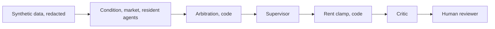

# Lease Renewal Decision Agent

Status: architecture phase. Designed, not built. Last updated 2026-10-03.

A multi-agent system that reviews single-family leases expiring within 90 days and recommends a renewal action, a rent change, the risks behind it, and a draft resident message. It is advisory only: it has no send or write capability, and a human approves every recommendation. All data is synthetic, and every recommendation is graded against an answer key.

> [!WARNING]
> Nothing runs yet. This repository holds the architecture: design docs and decision records. Every component below is designed, not built, tested, or evaluated.

## Contents
- [Problem](#problem)
- [Approach](#approach)
- [Scope](#scope)
- [Data and evaluation](#data-and-evaluation)
- [Status](#status)
- [How to run](#how-to-run)
- [Documentation](#documentation)
- [Sources](#sources)
- [Contributing](#contributing)
- [Security](#security)
- [Caution](#caution)
- [License](#license)
- [Known gaps and open questions](#known-gaps-and-open-questions)

## Problem
- Single-family rental operators make thousands of lease renewal decisions a year
- Inputs are scattered across market data, maintenance history, payment history, and resident messages
- Pricing a renewal too high drives costly turnover. Pricing too low leaves revenue on the table

## Approach
- Three specialist agents each own one data domain: condition, market, and resident
- A supervisor agent combines their findings into one recommendation: renew, renew with note, or escalate, plus a rent change, flags with cited evidence, and a draft resident message
- Model proposes, code enforces. Economics, arbitration of conflicting signals, the rent clamp (a policy floor and cap on every rent change), claim checks, and gate states are code
- A critic (code checks plus one compliance classifier) reviews each draft. A block ends the case in BLOCKED for manual review
- A human approves or rejects every recommendation in a reviewer UI

Full flow, gate states, and contracts: [docs/architecture.md](docs/architecture.md).

## Scope
- In scope: one fictional Dallas-Fort Worth market, 60 homes, recommendations and an audit record, offline evaluation
- Not in scope:
  - Sending messages or changing rents. The system only recommends and records
  - Real pricing. Rent values are fictional and not calibrated (DD-04)
  - State and local rules such as rent caps, notice periods, and local protected classes ([risks](docs/risks.md#outputs-read-as-legal-advice))

## Data and evaluation
- All data is synthetic and fictional, generated by code from a seed. No real residents, addresses, or messages
- 7 scenarios, each a planted, known cause (for example chronic maintenance, soft market, compliance trap, conflicting signals), with 5 variant homes each, plus 25 clean homes ([docs/scenarios.md](docs/scenarios.md))
- Protected-characteristic fields are redacted in the data layer before any model, span, or trace sees them
- Answer keys sit outside the agent-readable path. Only the eval harness reads them
- Grading is deterministic code against the answer keys. Results are named counts per scenario, compared against a single-agent baseline ([docs/eval-plan.md](docs/eval-plan.md))
- No results exist yet. Results tables appear only after a recorded run

## Status
Release one runs locally. Databricks Free Edition is the target platform. Target components are designed, not validated ([ADR-011](docs/decisions/ADR-011-databricks-target-local-first-release.md)).

| Component | Release one | Target | Status | Date |
|---|---|---|---|---|
| Architecture docs and ADRs | Docs in this repo | Same | In progress, M0 review open | 2026-10-03 |
| Data generator and validator | Seeded Python generator, Parquet | Lakeflow Spark Declarative Pipelines, Delta in Unity Catalog | Designed, not built. Target designed, not validated | 2026-10-03 |
| Redaction and key isolation | Python access layer, directory allowlist | Unity Catalog views or column masks | Designed, not built. Target designed, not validated | 2026-10-03 |
| Agents and orchestration | Plain Python asyncio | Same | Designed, not built | 2026-10-03 |
| Tool access | Custom thin MCP server, after evals | Managed Unity Catalog Functions MCP | Designed, not built. Target designed, not validated | 2026-10-03 |
| Observability | Local MLflow | Databricks-managed MLflow | Designed, not built. Target designed, not validated | 2026-10-03 |
| Approval and audit state | SQLite | Lakebase | Designed, not built. Target designed, not validated | 2026-10-03 |
| Reviewer UI | Streamlit in Docker Compose | Streamlit as a Databricks App | Designed, not built. Target designed, not validated | 2026-10-03 |
| Eval harness | Local, cached replay | Same | Designed, not built | 2026-10-03 |

- Local stand-ins do not preserve Unity Catalog governance, on-behalf-of auth, concurrency, or scale
- Milestones and the current step: [docs/progress.md](docs/progress.md)

## How to run
- Nothing runs yet
- Planned: Python 3.13 with uv, Docker Compose for the app, MLflow, and eval runner. Folder layout: [AGENTS.md](AGENTS.md#folder-layout)
- Model calls go through OpenRouter. Copy `.env.example` to `.env` for the key. Never commit `.env`

## Documentation

| Doc | What it covers |
|---|---|
| [Architecture](docs/architecture.md) | Code versus model boundary, data flow, gate states, contracts, target versus release one |
| [ADRs](docs/decisions/README.md) | 28 architecture decision records, one line each in the index |
| [Open decisions](docs/open-decisions.md) | Deferred decisions (DD-nn) and their gating events |
| [Scenarios](docs/scenarios.md) | Dataset, cities, planted scenarios, slots, clean homes |
| [Eval plan](docs/eval-plan.md) | Metrics, counts, run plan, model bake-off |
| [Risks](docs/risks.md) | Model, cost, evaluation, domain, and synthetic data risks with mitigations |
| [Progress](docs/progress.md) | Current position, milestones, and per-milestone logs |

## Sources
- City demand, rent ranges, turnover cost, and Fair Housing Act classes rest on secondary sources checked 2026-10-02. Table with links: [scenarios research notes](docs/scenarios.md#research-notes)
- They shape the fictional draft values. They do not calibrate them
- Calibration of the rent clamp and city rate tiers is deferred as DD-04 ([open decisions](docs/open-decisions.md)). It will use primary sources:
  - [HUD Small Area Fair Market Rents](https://www.huduser.gov/portal/datasets/fmr/smallarea/index.html), ZIP-level rents
  - [U.S. Census Bureau American Community Survey](https://www.census.gov/programs-surveys/acs)

## Contributing
- Rules for every contributor, human or coding agent: [AGENTS.md](AGENTS.md)
- Every pull request follows [the PR template](.github/pull_request_template.md)

## Security
- Do not open a public issue for a suspected vulnerability. Report it privately as described in [SECURITY.md](SECURITY.md)
- Usage questions and non-security bugs go to [issues](https://github.com/mbnest/lease-renewal-advisor/issues)

## Caution
- This project is not legal advice
- Rent recommendations are illustrative only and must not be used for real pricing or tenancy decisions without legal and compliance review

## License
- MIT. See [LICENSE](LICENSE)

## Known gaps and open questions
- DD-04 calibration is open. It will use HUD FY2027 Small Area Fair Market Rents, in its own PR
- The implementation plan is not yet tracked
