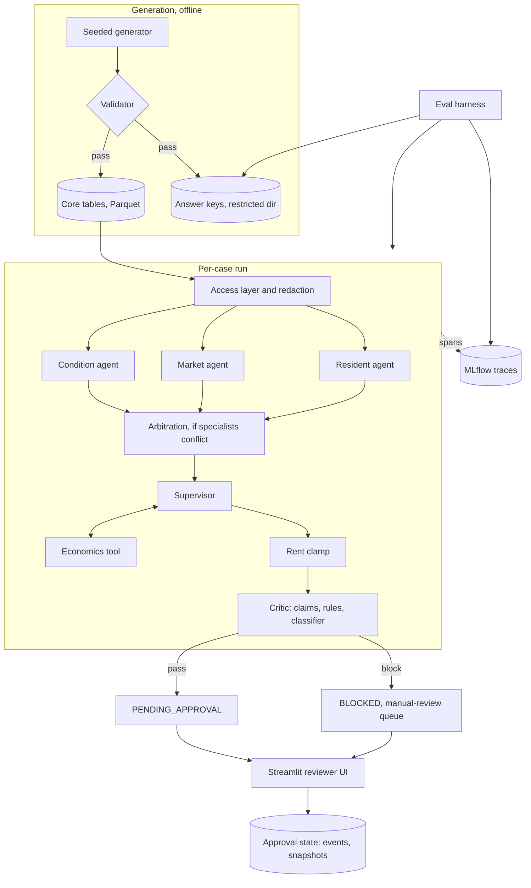
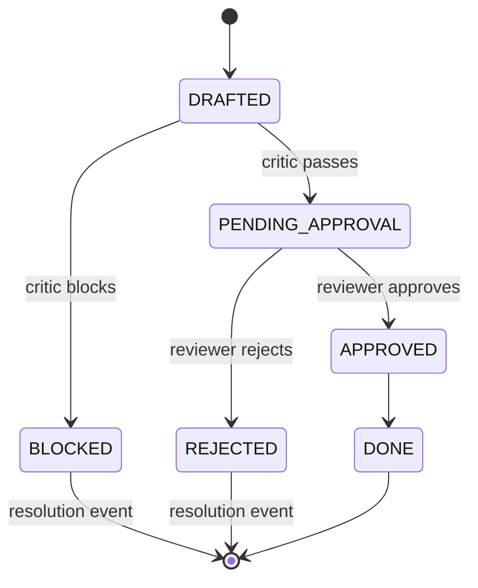

# Architecture

Status: designed, not built. Last updated 2026-10-02.
How the lease renewal decision agent fits together. All data is synthetic. Output is advisory. Each decision links to its ADR in [docs/decisions/](decisions/README.md). Deferred items (DD-nn) live in [docs/open-decisions.md](open-decisions.md).

## System summary
- Reviews each single-family lease expiring within 90 days and produces one recommendation:
  - Action: renew, renew with note, or escalate
  - Rent change, clamped to a policy range and graded as a named band
  - Flags with cited evidence
  - A drafted resident message
- Three LLM specialists (condition, market, resident) each own one data domain. An LLM supervisor synthesizes their findings
- Code owns everything that can be written down: economics, arbitration, the rent clamp, claim checks, and gate states
- The system has no send or write capability. It only recommends and records. A human approves or rejects every recommendation ([ADR-010](decisions/ADR-010-guardrails-tiering-and-audit-record.md))

## Code versus model boundary

| Component | Type | Why | ADR |
|---|---|---|---|
| Data generator and validator | Code | Ground truth must be reproducible from a seed | [ADR-013](decisions/ADR-013-ground-truth-and-compliance-trap.md), [ADR-023](decisions/ADR-023-substitution-data-prep.md) |
| Data access and redaction | Code | Protected fields are removed before any model, span, or trace sees them | [ADR-024](decisions/ADR-024-substitution-redaction-and-key-isolation.md) |
| Context prefetch | Code | Same inputs on every run of a case | [ADR-002](decisions/ADR-002-prefetched-context-for-specialists.md) |
| Condition, market, resident specialists | LLM | Judgment over text and mixed signals | [ADR-003](decisions/ADR-003-economics-and-critic-logic-stay-code.md) |
| Supervisor | LLM | Combines specialist findings and calls economics as a tool | [ADR-003](decisions/ADR-003-economics-and-critic-logic-stay-code.md) |
| Economics | Code, as a tool | Turnover cost against the renewal increase is arithmetic | [ADR-003](decisions/ADR-003-economics-and-critic-logic-stay-code.md) |
| Arbitration (scenario 8) | Code | Fixed precedence from policy config. Code decides, model explains | [ADR-018](decisions/ADR-018-fixed-arbitration-precedence.md) |
| Rent clamp | Code | Model proposes, code enforces | [ADR-020](decisions/ADR-020-rent-clamp-and-symbolic-bands.md) |
| Critic: claim checks and keyword rules | Code | Record ids and cited values are checkable | [ADR-004](decisions/ADR-004-critic-design.md) |
| Critic: compliance classifier | LLM | Paraphrase and proxies need judgment. Narrow, no tools, schema-validated verdict with a quoted span | [ADR-004](decisions/ADR-004-critic-design.md) |
| Gate and approval state | Code | No model in the control path | [ADR-010](decisions/ADR-010-guardrails-tiering-and-audit-record.md), [ADR-016](decisions/ADR-016-distinct-blocked-state.md) |
| Eval grading | Code | Deterministic against answer keys | [ADR-006](decisions/ADR-006-evaluation-grading-rules.md) |

## Component and data flow

- The flow is fixed: specialists in parallel, then arbitration in code, then the supervisor, which explains the arbitration outcome, then clamp and critic ([ADR-001](decisions/ADR-001-plain-python-asyncio-orchestration.md))
- No open-ended agent-to-agent chat, no dynamic planning, no retry loop
- Every agent returns schema-validated JSON. Steps and tokens are capped per case. Temperature is low
- Economics is the only tool-calling loop. Specialists have no data tools in release one ([ADR-002](decisions/ADR-002-prefetched-context-for-specialists.md))
- Only post-redaction data reaches prompts, spans, or trace storage
- Answer keys sit outside the agent-readable path. Only the eval harness reads them

## Gate states

- States: DRAFTED, BLOCKED, PENDING_APPROVAL, APPROVED, REJECTED, DONE ([ADR-010](decisions/ADR-010-guardrails-tiering-and-audit-record.md))
- Tiers: RECORD_ONLY and APPROVAL_REQUIRED. Every recommendation is APPROVAL_REQUIRED in release one
- An approval-required recommendation cannot reach DONE without a decision event. Enforced in code and tested
- BLOCKED and REJECTED are terminal. Each records a resolution event, which is not a new state ([ADR-016](decisions/ADR-016-distinct-blocked-state.md))
- A rerun after BLOCKED or REJECTED is a new recommendation version, never a move back to DRAFTED
- BLOCKED is never graded as an action. The pre-block proposal is graded separately
- Promotion from APPROVAL_REQUIRED to RECORD_ONLY is documented, not built ([ADR-019](decisions/ADR-019-promotion-criteria-and-threshold-freeze.md))

## Contracts
Field lists only. Schemas are written after M0, and final names may change then.

### Scenario spec
- Top level: seed, market id, policy config ref, cities, clean-home spec, scenarios
- City: name, rate tier, demand, home count. Rate tier and demand are separate attributes ([ADR-012](decisions/ADR-012-data-scale-scenarios-and-variants.md))
- Clean-home spec: total, near-clean types with counts
- Scenario: id, name, cause, flags, required agents, text fixtures, decoys, 5 slots, paired control, arbitration signals (scenario 8 only)
- Slot: role (strong, moderate, weak, near_boundary, tier_swap), city constraint, signal channel, parameter ranges
- Decoy: forbidden flag, description, parameter ranges
- Text fixture: id, kind, and for scenario 5 the protected category, explicitness (explicit, subtle, proxy), and location

### Answer key
- Identity: opaque home id, scenario id (none for clean homes), slot, pair id and role
- Expectation: action, direction, acceptable band set, severe-miss conditions
- Flags: required, and forbidden (decoys)
- Evidence: table, record id, field, value, rule, and text span where relevant
- Protected reference (scenario 5): category, explicitness, location, record id, span
- Required agents. Scenario 8 adds signals, the expected winner, and its direction
- File header: spec seed, policy version, validator version

### Policy config
- Version, thresholds, severity tag per flag type, combining rule, arbitration precedence, five bands, clamp ([ADR-014](decisions/ADR-014-thresholds-in-versioned-config.md))
- Flag types: chronic maintenance, late payment pattern, below market, soft demand, open complaint
- Agents see it. The generation-time validator reads it. Nothing recomputes it at runtime

### Recommendation
- Identity: case id, opaque home id, version, policy version, created_at, trace id
- Gate: tier, gate state
- Decision: action, pre-clamp rent proposal, clamped rent change, band
- Flags with evidence refs (record ids and cited values)
- Specialist outputs, arbitration note
- Critic verdict and critic reason. The BLOCKED card shows the critic reason
- Pre-block proposal: kept on BLOCKED for grading, never shown as a draft
- Draft message: absent when BLOCKED

### Approval state
All append-only, behind one repository interface ([ADR-009](decisions/ADR-009-streamlit-reviewer-ui-and-sqlite-state.md), [ADR-026](decisions/ADR-026-substitution-approval-and-audit-state.md))
- Decision event: case id, recommendation version, action, reviewer, timestamp, reason
- Resolution event (BLOCKED, REJECTED): case id, recommendation version, disposition, reviewer, timestamp, reason. Disposition values are open (DD-09)
- Audit snapshot: immutable copy of the recommendation version, taken when the critic verdict is recorded and the version leaves DRAFTED for BLOCKED or PENDING_APPROVAL. JSON export for published samples
- Reproducibility metadata (model id, prompt versions, policy config, git commit, data seed) lives in trace attributes, MLflow run params, and the snapshot manifest, not in the audit record

### Tool contract
- Tool names plus Pydantic input and output schemas. Agent code does not know the backend ([ADR-005](decisions/ADR-005-custom-thin-mcp-server.md))
- Calls are fixed and parameterized. No generated SQL

## Validator and policy rules
Designed, not built. Implemented with the schemas after M0.

### Policy resolution
- Band for a rent change: HOLD at exactly 0. Otherwise the band whose range holds the value ([ADR-020](decisions/ADR-020-rent-clamp-and-symbolic-bands.md))

| Band | Range (percent change) | Direction |
|---|---|---|
| REDUCE | -3 up to but excluding 0 | Reduce |
| HOLD | Exactly 0 | Hold |
| LOW | Above 0 to 3 | Raise |
| MODERATE | Above 3 to 6 | Raise |
| HIGH | Above 6 to 9 | Raise |

- Clamp: floor -3%, cap +9%. Placeholders until calibration (DD-04)
- Action: no flags gives renew. Otherwise highest severity wins, escalate over note ([ADR-015](decisions/ADR-015-action-definitions-with-severity-tags.md))
- Severity: escalate for chronic maintenance and open complaint. Note for late payment pattern, below market, soft demand
- Arbitration: on a specialist conflict, the first match in precedence sets rent direction: condition escalation, then market, then resident. Severity tags still set the action. Signal vocabulary is in `docs/scenarios.md`
- Config must define a severity tag for every flag type, all five bands, and each specialist once in precedence

### Spec rules
- Exactly 5 slots per scenario, one per role
- City home counts sum to planted plus clean homes
- Slot city constraints name known cities. Parameter ranges have min at or below max
- Near-clean counts do not exceed the clean total

### Key rules
- Required and forbidden flags do not overlap
- All acceptable bands share the expected direction
- Clean homes expect renew with no required flags
- Every required flag cites evidence
- A treated home has a protected reference and pair info. Its paired control is a plain clean home
- Treated and control share expected action, direction, and bands. Each pair id has both roles
- Home ids are unique

### Generation-time validator
The only code that evaluates thresholds ([ADR-014](decisions/ADR-014-thresholds-in-versioned-config.md)). Generation fails on any violation. Rules are versioned with the key.
- Flags recomputed from generated tables equal the required flags
- No forbidden (decoy) flag fires
- Each evidence ref resolves to its table, record, field, and value. Text spans reproduce the quoted text
- Policy action for the required flags equals the expected action
- Expected direction and bands are reachable inside the clamp
- Near-boundary slots sit at or within one step of the threshold, on the stated side
- Scenario 8: expected winner is the first matching specialist in precedence
- Clean homes recompute to zero flags. Near-clean types stay under thresholds
- Pairs: tables identical except the protected reference
- Leakage: no scenario label or cause name in any text fixture. Keys absent from the agent-readable directory. Row order shuffled. Ids opaque

## Evaluation
Full method in `docs/eval-plan.md` (planned).
- Separate named counts per scenario. No percentages, no composite score ([ADR-006](decisions/ADR-006-evaluation-grading-rules.md))
- Rent: direction and clamp pass or fail, band exact and within-one counts, on both pre-clamp and clamped values
- Action: strict three-way match with a confusion matrix. Severe misses counted by name
- Flags and compliance: flag recall, clean-home false positives, compliance detected, outcome matched control, influenced before the critic acted, blocked and false-block counts, threshold misapplied
- Single-agent baseline first. Specialists added one at a time, each with a score delta checkpoint
- Run plan: 3 runs for baseline and full multi-agent only, 1 run elsewhere, dev on a 20-home subset from cache ([ADR-028](decisions/ADR-028-cost-envelope.md))
- One hash-keyed call cache for dev, frozen snapshot with manifest for published results. Replay fails loudly on a miss ([ADR-007](decisions/ADR-007-one-cache-mechanism-two-lifecycle-points.md))

## Observability
- Agent code traces through `@traced(kind, name)`. Only the decorator imports MLflow. It starts as a no-op stub ([ADR-008](decisions/ADR-008-mlflow-tracing-behind-own-decorator.md))
- Attributes: case id, run index, cache hit, token counts, schema validation result, critic verdict
- Cache replay still emits spans, tagged as cache hits
- Checks: every registered agent and tool is traced. Parallel specialist spans nest under the supervisor span (DD-05)
- Eval files are the source of truth. MLflow holds a copy

## Models
- OpenRouter is the single gateway ([ADR-017](decisions/ADR-017-one-gateway-tiered-models.md))
- Smaller tier for specialists. Larger tier for the supervisor and the compliance classifier
- Tiering note: tiering was chosen partly to keep the project manageable. A production deployment would test model fit per agent
- Models are not named yet. A baseline bake-off picks them, and tier-to-agent assignment is config (DD-02)
- Pin model slug and upstream provider, disable fallback routing. Provider, slug, and price at run time go into the cache key and snapshot manifest
- Spend: provisional $50 ceiling, per-run spend abort in config (DD-08)

## Reviewer experience
- Streamlit pages: approval queue, per-home card, operational dashboard with rollups by city. One market, so the market is a header total ([ADR-009](decisions/ADR-009-streamlit-reviewer-ui-and-sqlite-state.md))
- Card header: action, rent change and band, top flags, approve and reject
- Card panels: evidence per flag, specialist summaries, critic verdict, comp and prior-rent context, draft message
- BLOCKED cards show the critic reason and no draft
- Reviewer powers: approve or reject only. Any future edit path must rerun the clamp and the critic before approval
- No eval page in the app

## Platform: target versus release one
Target components are designed, not validated ([ADR-011](decisions/ADR-011-databricks-target-local-first-release.md)). The target is Databricks Free Edition.

| Concern | Target | Release one | Seam | ADR |
|---|---|---|---|---|
| Storage | Delta in Unity Catalog | Parquet | Data-access interface | [ADR-021](decisions/ADR-021-substitution-storage.md) |
| Tool access | Managed UC Functions MCP | Custom thin MCP server, after evals | Tool contract | [ADR-022](decisions/ADR-022-substitution-tool-access.md) |
| Data prep | Lakeflow Spark Declarative Pipelines | Seeded Python generator | Generator output schema | [ADR-023](decisions/ADR-023-substitution-data-prep.md) |
| Redaction and key isolation | UC views or column masks, restricted key schema | Python access layer, directory allowlist | Redaction interface, identical-output test | [ADR-024](decisions/ADR-024-substitution-redaction-and-key-isolation.md) |
| Observability | Databricks-managed MLflow | Local MLflow in Docker | `@traced` decorator | [ADR-025](decisions/ADR-025-substitution-observability.md) |
| Approval and audit state | Lakebase | SQLite | Repository interface | [ADR-026](decisions/ADR-026-substitution-approval-and-audit-state.md) |
| Reviewer UI | Streamlit as a Databricks App | Streamlit in Docker Compose | None, config only | [ADR-027](decisions/ADR-027-substitution-reviewer-ui.md) |
| Orchestration | Plain Python asyncio | Same | n/a | [ADR-001](decisions/ADR-001-plain-python-asyncio-orchestration.md) |

- Stand-ins do not preserve UC governance, on-behalf-of auth, concurrency, or scale
- Packaging: Docker Compose with app, MLflow, and eval runner services on shared volumes. SQLite is single-user
- Evals stay local with cached replay. The Databricks phase starts after the local release is complete and documented

## Known gaps and open questions
- The trigger for APPROVED to DONE is not defined (DD-12)
- Thin model client interface and typed claim vocabulary are not specified ([ADR-001](decisions/ADR-001-plain-python-asyncio-orchestration.md), [ADR-004](decisions/ADR-004-critic-design.md))
- Protected field list, schema names, and config file name are set with the schemas after M0
- Tuned thresholds and severity tags (DD-01), model selection (DD-02), promotion thresholds (DD-03), clamp calibration (DD-04), MLflow pin (DD-05), Free Edition feasibility (DD-06), cost (DD-08), disposition vocabulary (DD-09), DONE trigger (DD-12)
- Checks named here are not yet tied to test ids. The test register is planned
- `docs/eval-plan.md` and `docs/scenarios.md` are not written yet
